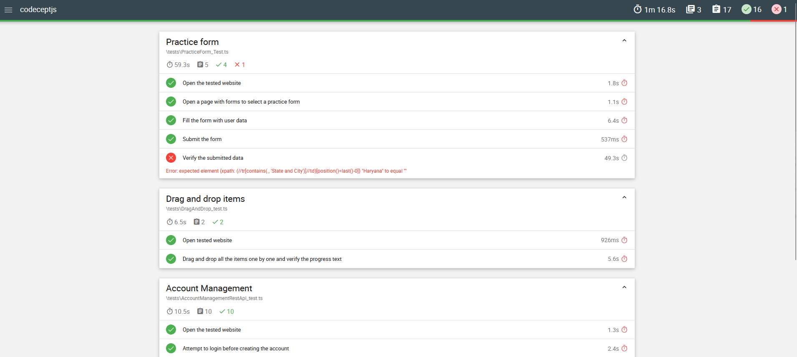

# CodeceptJS test showcase

⚠️WIP⚠️  

End-to-end tests written in **CodeceptJS** using **Playwright** and **Typescript**.

---

## Prerequisites

- Node.js
- npm

---

## Setup

1. Install dependencies:

    ```bash
    npm install
    ```

2. Install Playwright browsers:

    ```bash
    npx playwright install
    ```

3. Initialize CodeceptJS configuration:

    ```bash
    npx codeceptjs def
    ```

---

## Running Tests


### Run all tests

        npx codeceptjs run --verbose


    
### Run a single test
        npx codeceptjs run ./tests/<test_name> --verbose

Currently, tests are verified on Chromium only.

### TODO: 
1. Mochawesome reporting
